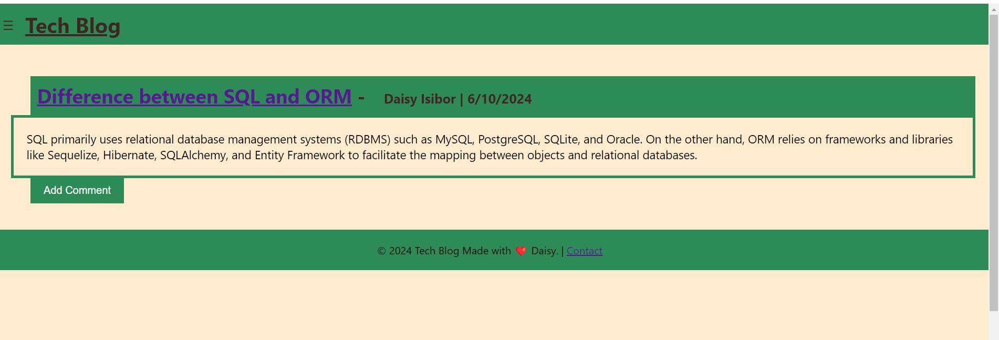
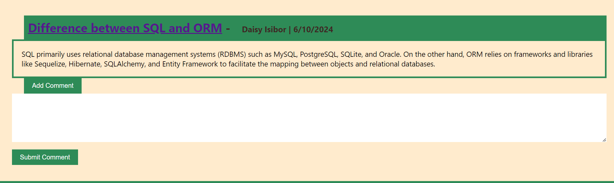
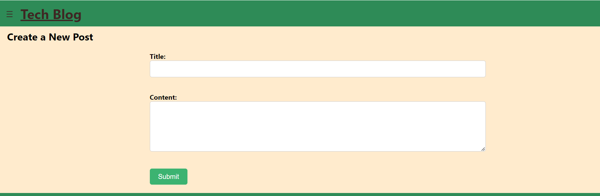
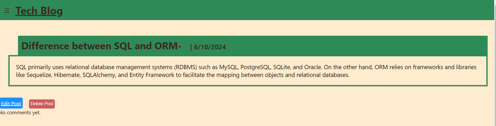

# Tech-Blog

## Table of Contents
- [Description](#description)
- [Installation](#Installation)
  [User Story](#user-story)
  [Acceptance Criteria](#acceptance-criteria)
- [Usage](#Usage)
- [Tests](#Tests)
  [Questions](#questions)
- [License](#license)

## Description

Tech-Blog is an intuitive CMS-style platform designed for tech enthusiasts and developers to share their insights and expertise. It allows users to publish articles, blog posts, and opinions on various tech topics with ease. The site features a user-friendly interface, secure login system using bcrypt for password masking, and robust commenting functionality, fostering a vibrant community of tech writers and readers.

## Installation

To install and run the Tech-Blog application, follow these steps:

Clone the repository from GitHub: git clone https://github.com/your-repo.git

Navigate into the project directory: cd tech-blog

Install dependencies: npm install

Set up your database by running the SQL schema file provided.

Create a .env file based on the .env.example and provide your environment variables.

Start the application: npm start

## User Story

AS A developer who writes about tech
I WANT a CMS-style blog site
SO THAT I can publish articles, blog posts, and my thoughts and opinions

## Acceptance Criteria

GIVEN a CMS-style blog site
WHEN I visit the site for the first time
THEN I am presented with the homepage, which includes existing blog posts if any have been posted; navigation links for the homepage and the dashboard; and the option to log in
WHEN I click on the homepage option
THEN I am taken to the homepage
WHEN I click on any other links in the navigation
THEN I am prompted to either sign up or sign in
WHEN I choose to sign up
THEN I am prompted to create a username and password
WHEN I click on the sign-up button
THEN my user credentials are saved and I am logged into the site
WHEN I revisit the site at a later time and choose to sign in
THEN I am prompted to enter my username and password
WHEN I am signed in to the site
THEN I see navigation links for the homepage, the dashboard, and the option to log out
WHEN I click on the homepage option in the navigation
THEN I am taken to the homepage and presented with existing blog posts that include the post title and the date created
WHEN I click on an existing blog post
THEN I am presented with the post title, contents, post creator’s username, and date created for that post and have the option to leave a comment
WHEN I enter a comment and click on the submit button while signed in
THEN the comment is saved and the post is updated to display the comment, the comment creator’s username, and the date created
WHEN I click on the dashboard option in the navigation
THEN I am taken to the dashboard and presented with any blog posts I have already created and the option to add a new blog post
WHEN I click on the button to add a new blog post
THEN I am prompted to enter both a title and contents for my blog post
WHEN I click on the button to create a new blog post
THEN the title and contents of my post are saved and I am taken back to an updated dashboard with my new blog post
WHEN I click on one of my existing posts in the dashboard
THEN I am able to delete or update my post and taken back to an updated dashboard
WHEN I click on the logout option in the navigation
THEN I am signed out of the site
WHEN I am idle on the site for more than a set time
THEN I am able to view posts and comments but I am prompted to log in again before I can add, update, or delete posts

## resources 
 links used for my tech blog 

https://www.freecodecamp.org/news/how-to-build-sign-up-form-with-html-and-css/
https://github.com/fuuko08/MVC-Tech-Blog

## Usage
Once the application is installed and running, you can access it through your web browser. Users can:

View blog posts on the homepage.

Sign up for an account or log in with existing credentials.

Create new blog posts, edit, or delete their existing posts from the dashboard.

Comment on posts to engage with other users.

http://localhost:3001/api/comments/7 
http://localhost:3001/api/comments
http://localhost:3001/api/comments/1
http://localhost:3001/api/comments

## Tests
To run tests for the Tech-Blog application, execute the following command:
npm start

## Questions

- **GitHub**: [daisy isibor](https://github.com/daisy isibor)
- **Email**: daisyisibor9@gmail.com

## License
This project is licensed under the 

